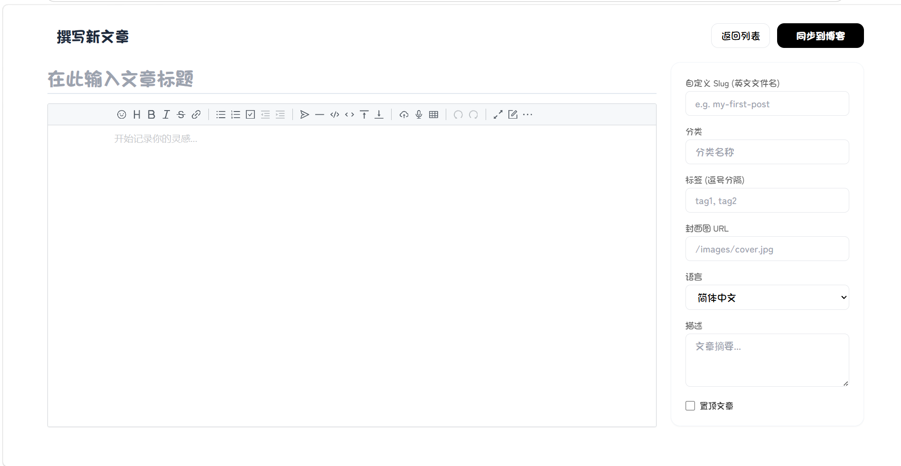

# Mizuki Go Blog

基于 [Mizuki](https://github.com/matsuzaka-yuki/mizuki) 主题的前后端分离博客系统。前端 Astro 静态生成，后端 Go + Gin 提供 API 和管理后台。

## 技术栈

| 层 | 技术 |
|---|---|
| 前端 | Astro + Tailwind CSS + TypeScript + Svelte |
| 后端 | Go + Gin + GORM |
| 数据库 | MySQL |
| 编辑器 | Vditor（Markdown） |
| 认证 | JWT |
| 日志 | Go 标准库 `log/slog` |

## 项目结构

```
├── frontend/                  # Astro 前端（基于 Mizuki 主题）
│   └── src/
│       ├── pages/admin/       # 管理后台页面
│       ├── components/admin/  # 管理后台组件
│       ├── scripts/           # TypeScript 核心逻辑
│       ├── content/posts/     # 文章 Markdown 文件
│       ├── data/              # 站点配置和日记数据
│       └── styles/            # 样式文件
├── backend/                   # Go 后端
│   ├── main.go                # 入口 + 路由注册
│   ├── config/                # 配置加载
│   ├── controller/            # Controller 层（HTTP 处理）
│   ├── service/               # Service 层（业务逻辑）
│   ├── models/                # Model 层（数据库实体）
│   ├── middleware/             # JWT 认证 + 限流中间件
│   ├── logger/                # 结构化日志模块
│   ├── validator/             # 输入校验（路径穿越防护）
│   └── untils/                # JWT 工具函数
```

## 预览


## 功能

### 前台
- 文章展示（分类、标签、搜索）
- 日记/碎碎念、相册、番剧追踪
- 友链、时间线、关于页面
- 暗色模式、响应式布局
- 樱花特效、Live2D 看板娘

### 管理后台
- **文章管理**：Vditor Markdown 编辑器，MySQL + 文件系统双写
- **日记管理**：JSON 文件存储，自动同步前端数据文件
- **相册管理**：文件系统增删改查，封面设置
- **站点配置**：可视化编辑全部主题设置
- **用户管理**：添加/删除管理员，修改密码
- **图片上传**：上下文感知目录路由，发布时自动搬运
- **前端重构**：一键触发 `pnpm build`




### 安全
- 路径穿越防护（SafePath/SafeSlug 校验）
- 登录限流（每 IP 每分钟 5 次）
- JWT 吊销机制（改密码后旧 token 全部失效）
- 文件上传类型与大小限制
- CORS 来源限制 + 安全响应头
- 错误信息脱敏 + 敏感配置环境变量化

## 本地运行

### 1. 数据库

创建 MySQL 数据库：

```sql
CREATE DATABASE blog_db DEFAULT CHARACTER SET utf8mb4 COLLATE utf8mb4_unicode_ci;
```

### 2. 后端

```bash
cd backend

# 修改 config.yaml 或设置环境变量
# DB_DSN  - MySQL 连接串
# JWT_SECRET - JWT 签名密钥
# OWNER_PASSWORD - 初始所有者密码（首次启动时创建）

go run main.go
```

后端默认监听 `http://localhost:8080`。

### 3. 前端

```bash
cd frontend
pnpm install
pnpm dev
```

前端开发服务器默认监听 `http://localhost:4321`，API 请求通过 Vite proxy 转发到后端。

## 部署

### 构建前端

```bash
cd frontend
pnpm build  # 输出到 dist/
```

### 编译后端

```bash
cd backend
go build -o my-blog-backend .
```

### systemd 服务

```ini
[Unit]
Description=My Blog Backend
After=network.target

[Service]
Type=simple
User=your-user
WorkingDirectory=/www/my-blog-project/backend
Environment="DB_DSN=user:pass@tcp(127.0.0.1:3306)/blog_db?charset=utf8mb4&parseTime=True&loc=Local"
Environment="JWT_SECRET=your-jwt-secret"
Environment="OWNER_PASSWORD=your-password"
Environment="CORS_ORIGIN=https://your-domain.com"
Environment="GIN_MODE=release"
ExecStart=/www/my-blog-project/backend/my-blog-backend
Restart=always
RestartSec=5

[Install]
WantedBy=multi-user.target
```

### Nginx 配置

```nginx
server {
    listen 80;
    server_name your-domain.com;

    root /www/my-blog-project/frontend/dist;
    try_files $uri $uri/ /index.html;

    location /api/ {
        proxy_pass http://127.0.0.1:8080;
        proxy_set_header Host $host;
        proxy_set_header X-Real-IP $remote_addr;
    }

    location /images/albums/ {
        alias /www/my-blog-project/frontend/public/images/albums/;
    }
}
```

## 致谢

- [Mizuki](https://github.com/matsuzaka-yuki/mizuki) — 优秀的 Astro 博客主题
- [Vditor](https://github.com/Vanessa219/vditor) — 浏览器端 Markdown 编辑器
